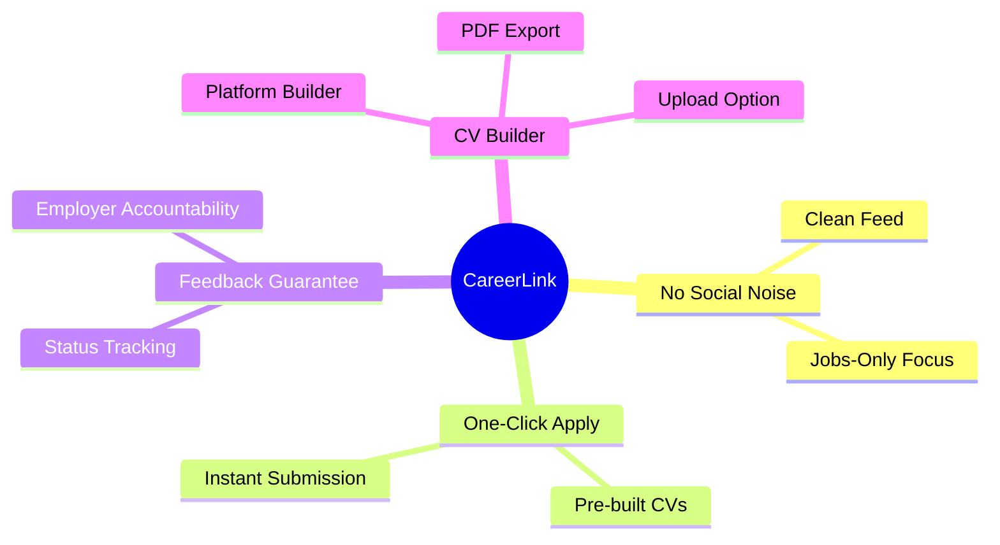
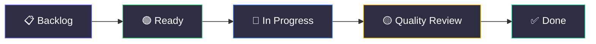
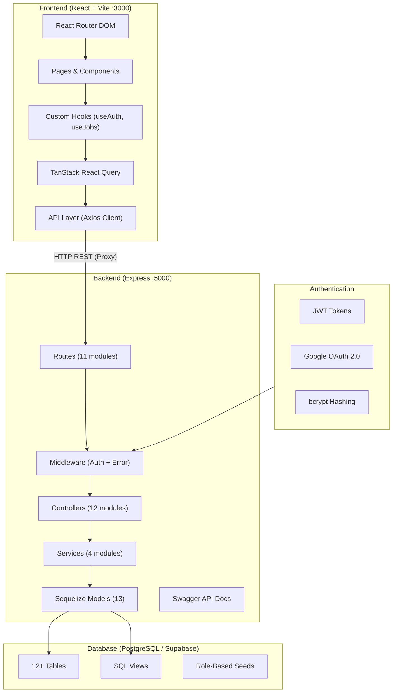
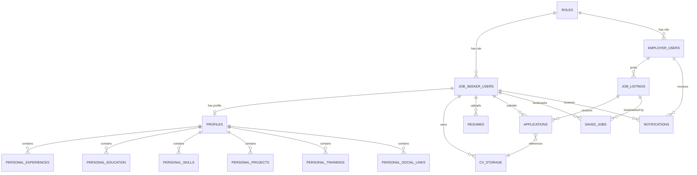
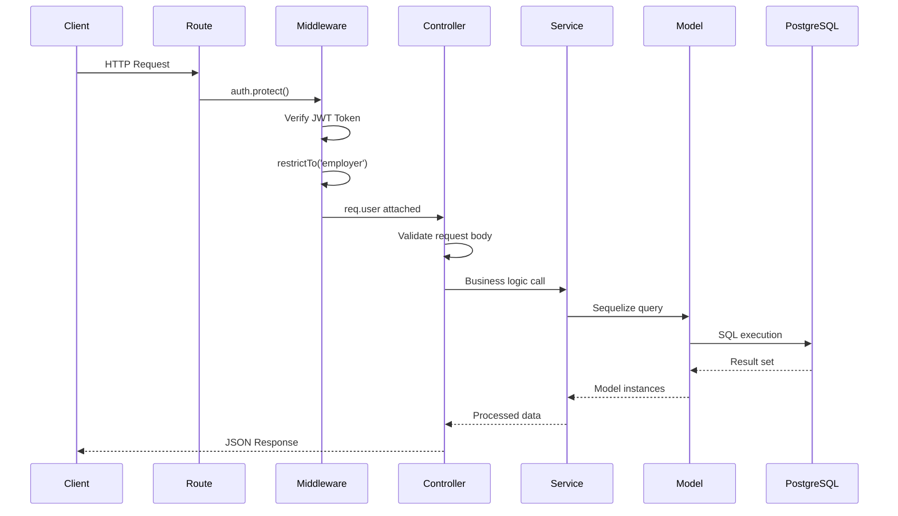
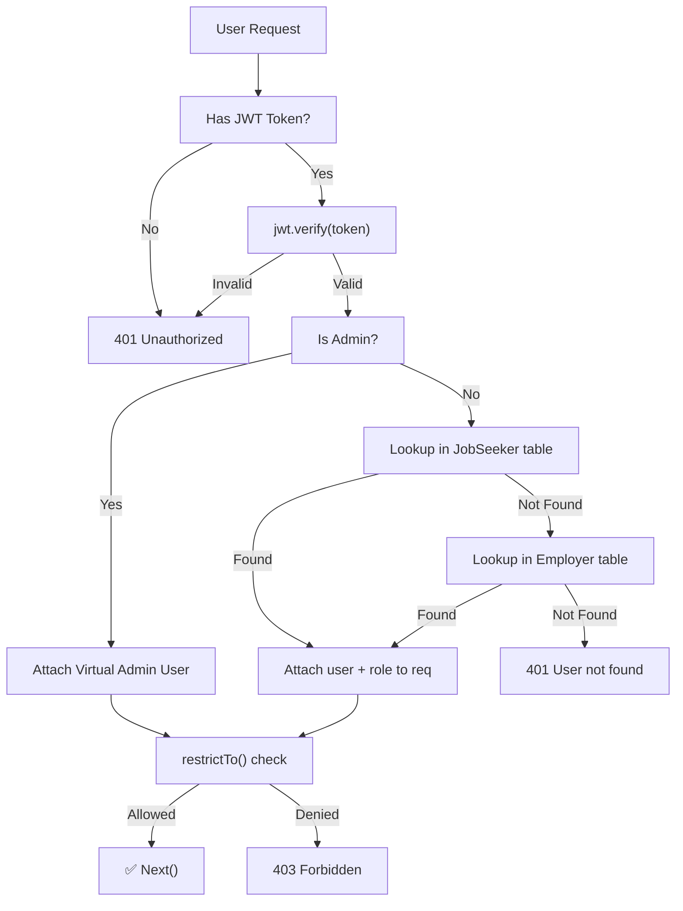
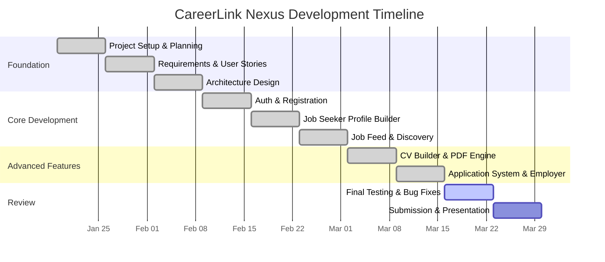
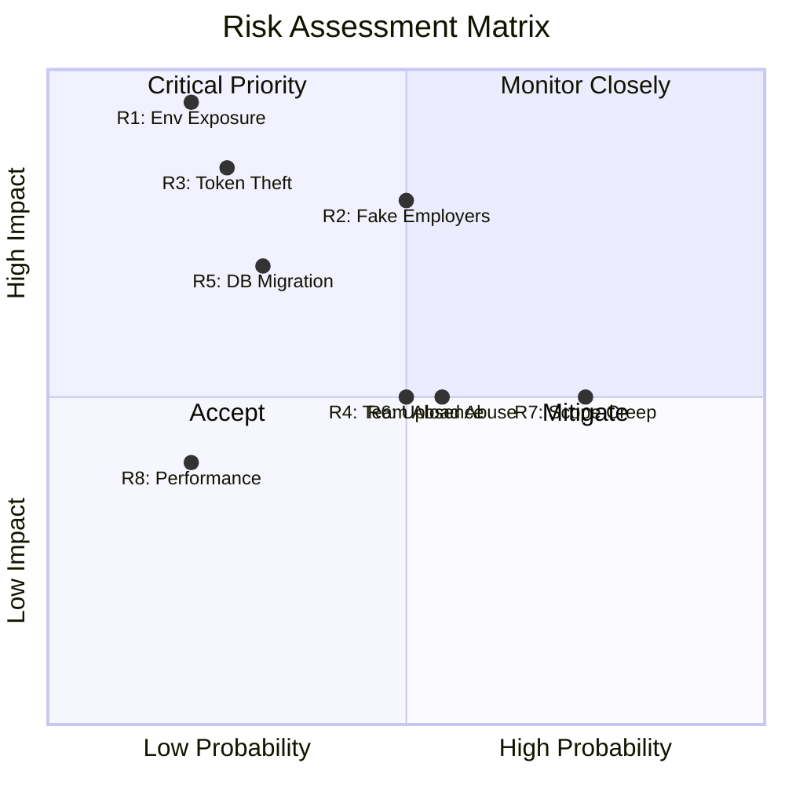
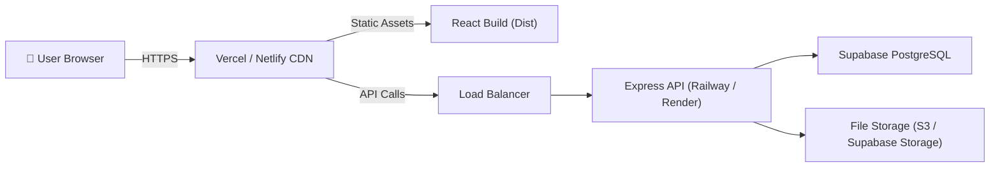

# 📋 CareerLink Nexus — Professional Project Plan

**Module:** CIS047-3 Agile Project Management  
**Institution:** University of Bedfordshire  
**Team:** Team Nexus  
**Version:** 1.0  
**Date:** March 18, 2026  
**License:** MIT  

---

## Table of Contents

1. [Executive Summary](#1-executive-summary)
2. [Project Vision & Objectives](#2-project-vision--objectives)
3. [Team Structure & Agile Roles](#3-team-structure--agile-roles)
4. [Methodology: Scrumban Framework](#4-methodology-scrumban-framework)
5. [Technology Stack & Architecture](#5-technology-stack--architecture)
6. [System Architecture Diagram](#6-system-architecture-diagram)
7. [Database Design & Schema](#7-database-design--schema)
8. [Feature Breakdown & User Stories](#8-feature-breakdown--user-stories)
9. [API Endpoint Catalogue](#9-api-endpoint-catalogue)
10. [Frontend Architecture & Routing](#10-frontend-architecture--routing)
11. [Backend Architecture (SCR Pattern)](#11-backend-architecture-scr-pattern)
12. [Sprint Roadmap & Timeline](#12-sprint-roadmap--timeline)
13. [Testing Strategy & Test Cases](#13-testing-strategy--test-cases)
14. [Security & Legal Compliance](#14-security--legal-compliance)
15. [Risk Assessment & Mitigation](#15-risk-assessment--mitigation)
16. [Deployment Strategy](#16-deployment-strategy)
17. [Definition of Done](#17-definition-of-done)
18. [Appendices](#18-appendices)

---

## 1. Executive Summary

**CareerLink Nexus** is a minimalist, feedback-first job portal designed specifically for students and early-career job seekers. Unlike social-media-heavy job platforms such as LinkedIn, CareerLink strips away distractions and focuses on three core differentiators:

1. **One-Click Apply** — Seekers build or upload a CV once, then apply to any job with a single click.
2. **Mandatory Employer Feedback** — Employers must update application statuses, eliminating the "black hole" of unanswered applications.
3. **Dynamic CV Builder** — A structured, in-platform CV builder that allows seekers to create professional resumes without external tools.

The platform serves **three user roles**: **Job Seekers**, **Employers**, and **System Administrators**, each with dedicated dashboards, role-based access controls, and tailored user experiences.

> [!IMPORTANT]
> CareerLink is developed as a full-stack production-grade application under the Scrumban methodology, demonstrating mastery of Agile roles (Product Owner, Quality Manager, Risk Manager, etc.) within a real software development lifecycle.

---

## 2. Project Vision & Objectives

### 2.1 Vision Statement

> *"To end the frustration of applying into a void — by building a distraction-free, feedback-guaranteed job portal for the next generation of professionals."*

### 2.2 Primary Objectives

| # | Objective | Success Criteria |
|---|-----------|-----------------|
| O1 | Build a fully functional dual-portal (Seeker + Employer) | Both user types can complete end-to-end workflows |
| O2 | Implement secure authentication with Google SSO | JWT-based auth with role-based access control |
| O3 | Deliver a dynamic CV Builder with PDF export | Seekers can build, save, and export professional CVs |
| O4 | Enable full application lifecycle tracking | Employers can review, shortlist, and reject with status updates |
| O5 | Build an Admin dashboard for platform oversight | Admin can verify employers, manage users, and review system stats |
| O6 | Follow SOLID principles and clean architecture | Scalable codebase with Service-Controller-Route pattern |
| O7 | Implement glassmorphism UI with dark/light theming | Premium, modern visual aesthetic |

### 2.3 Key Differentiators



---

## 3. Team Structure & Agile Roles

### 3.1 Team Nexus Members

| Name | Agile Role | Core Responsibilities |
|:-----|:-----------|:---------------------|
| **Nihariks Shakya** | Product Owner / Manager | Feature vision, backlog prioritization, stakeholder alignment |
| **Sayub Shakya** | Scheduling Manager | Sprint flow management, meeting planning, Kanban board synchronization |
| **Aayush Man Shakya** | Start-up Manager | Problem definition, user persona research, technical configuration |
| **DipeshRaj Shrestha** | Quality Manager | Acceptance criteria definition, code reviews, testing standards enforcement |
| **Amogh Shakya** | Risk Manager | Threat identification, mitigation planning, security audits |

### 3.2 Communication Protocol

| Channel | Purpose | Frequency |
|---------|---------|-----------|
| Google Chat (Nexus Group) | Daily sync, quick questions, pair programming requests | Daily |
| Google Meet | Weekly stand-up meetings | Sundays @ 9:00 PM |
| Classroom Sessions | Face-to-face brainstorming, teacher consultation | As scheduled |
| Internal Demos | "Show and Tell" sessions for early bug catching | End of each sprint |

---

## 4. Methodology: Scrumban Framework

CareerLink is built using **Scrumban** — a hybrid methodology that combines the planning discipline of **Scrum** with the continuous flow and visual management of **Kanban**.

### 4.1 Kanban Board Workflow



| Column | WIP Limit | Description |
|--------|-----------|-------------|
| **Backlog** | Unlimited | Future ideas, unrefined requirements |
| **Ready** | 5 | Priority tasks for the current sprint week |
| **In Progress** | 1–2 per person | Actively being developed |
| **Quality Review** | 3 | Code awaiting QA verification by Quality Manager |
| **Done** | N/A | Fully tested, reviewed, and merged to `main` |

### 4.2 Git & Branching Strategy

| Rule | Description |
|------|-------------|
| **Never push to `main`** | All features start in a `feature/<name>` branch |
| **Pull Requests** | Merging requires review from Quality Manager or PM |
| **Commit Convention** | `feat:`, `fix:`, `docs:`, `refactor:`, `test:` prefixes |
| **Code Review** | Every PR is inspected through specialized "Agile Lenses" |

### 4.3 Agile Lenses (Review Perspectives)

Each team member reviews work through their specialized lens:

- **Product Lens** (PM): Does this match the user story?
- **Quality Lens** (QM): Are test cases passing? Any console errors?
- **Risk Lens** (RM): Any security vulnerabilities? Data exposure risks?
- **Schedule Lens** (SM): Is this within sprint scope? Does it block other tasks?
- **Startup Lens** (SUM): Does the user persona benefit from this feature?

---

## 5. Technology Stack & Architecture

### 5.1 Full Stack Overview

````carousel
### 🖥️ Frontend Stack

| Technology | Version | Purpose |
|:-----------|:--------|:--------|
| **React.js** | 19.2.0 | UI component library |
| **Vite** | 7.2.4 | Build tool & dev server |
| **React Router DOM** | 7.13.0 | Client-side routing |
| **TanStack React Query** | 5.90.21 | Server state management & caching |
| **Axios** | 1.13.4 | HTTP client for API calls |
| **Lucide React** | 0.563.0 | Modern icon library |
| **React Hot Toast** | 2.6.0 | Toast notifications |
| **Google OAuth** | 0.13.4 | Google SSO integration |
| **Vanilla CSS** | — | Custom glassmorphism design system |

<!-- slide -->

### ⚙️ Backend Stack

| Technology | Version | Purpose |
|:-----------|:--------|:--------|
| **Node.js** | LTS | Server runtime |
| **Express.js** | 5.2.1 | REST API framework |
| **Sequelize** | 6.37.7 | ORM for database operations |
| **PostgreSQL** | — | Relational database (via Supabase) |
| **JWT (jsonwebtoken)** | 9.0.3 | Token-based authentication |
| **bcryptjs** | 3.0.3 | Password hashing |
| **Multer** | 2.0.2 | File upload handling (CVs, images) |
| **PDFKit** | 0.17.2 | Dynamic PDF generation for CVs |
| **Swagger** | 6.2.8 | API documentation |
| **google-auth-library** | 10.6.1 | Google OAuth verification |

<!-- slide -->

### 🗄️ Infrastructure & DevOps

| Technology | Purpose |
|:-----------|:--------|
| **Supabase (PostgreSQL)** | Cloud-hosted relational database |
| **Vite Dev Server** | Hot module replacement for frontend |
| **Express Session** | Server-side session management |
| **CORS** | Cross-origin resource sharing configuration |
| **ESLint** | Code quality & linting |
| **Git / GitHub** | Version control & collaboration |
````

### 5.2 Architecture Pattern

```
┌──────────────────────────────────────────────────────────────────┐
│                        CLIENT (React + Vite)                     │
│  ┌──────────┐  ┌──────────┐  ┌──────────┐  ┌──────────────────┐ │
│  │  Pages   │  │Components│  │  Hooks   │  │ API Layer        │ │
│  │          │──│          │──│ (React   │──│ (Axios Client +  │ │
│  │          │  │          │  │  Query)  │  │  Endpoints)      │ │
│  └──────────┘  └──────────┘  └──────────┘  └────────┬─────────┘ │
└─────────────────────────────────────────────────────┼───────────┘
                                                      │ HTTP/REST
                                              ┌───────▼────────┐
                                              │  Vite Proxy    │
                                              │  :3000 → :5000 │
                                              └───────┬────────┘
┌─────────────────────────────────────────────────────┼───────────┐
│                     SERVER (Node.js + Express)      │           │
│  ┌──────────┐  ┌──────────────┐  ┌──────────────┐  │           │
│  │  Routes  │──│ Controllers  │──│  Services    │  │           │
│  │          │  │ (Req/Res)    │  │ (Business    │  │           │
│  │          │  │              │  │  Logic)      │  │           │
│  └──────────┘  └──────────────┘  └──────┬───────┘  │           │
│  ┌──────────┐  ┌──────────────┐         │          │           │
│  │Middleware│  │   Models     │─────────┘          │           │
│  │(Auth/Err)│  │ (Sequelize)  │                     │           │
│  └──────────┘  └──────┬───────┘                     │           │
└────────────────────────┼────────────────────────────┘           │
                         │ SQL                                     │
                  ┌──────▼────────┐                                │
                  │  PostgreSQL   │                                │
                  │  (Supabase)   │                                │
                  └───────────────┘
```

---

## 6. System Architecture Diagram



---

## 7. Database Design & Schema

### 7.1 Entity Relationship Overview



### 7.2 Core Tables Summary

| Table | Purpose | Key Columns |
|:------|:--------|:------------|
| `roles` | User role definitions | `name` (job_seeker, employer, admin) |
| `job_seeker_users` | Seeker authentication & identity | `email`, `firstName`, `lastName`, `profile_picture` |
| `employer_users` | Employer/company profiles | `companyName`, `companyWebsite`, `industry`, `is_verified` |
| `profiles` | Professional profile base (1:1 with seeker) | `headline`, `bio/summary`, `phone`, `location` |
| `personal_experiences` | Work history records | `company_name`, `job_title`, `description` |
| `personal_education` | Academic history | `institution`, `degree` |
| `personal_skills` | Skill sets | `skill_name`, `skill_type` (Technical/Soft) |
| `personal_projects` | Portfolio entries | Project name, description, links |
| `personal_trainings` | Certifications & training | Training details |
| `job_listings` | Job postings by employers | `title`, `description`, `salary`, `jobType`, `deadline`, `views` |
| `applications` | Seeker-to-job junction | `status` (applied → reviewed → shortlisted → rejected), `cover_letter` |
| `cv_storage` | Platform-built or uploaded CVs | `type` (platform/uploaded), `content` (JSON), `file_path` |
| `resumes` | Uploaded PDF files | `resume_url`, `is_default` |
| `saved_jobs` | Bookmarked jobs | `seeker_id`, `job_id` |
| `notifications` | In-app notification records | `user_type`, `title`, `message`, `is_read` |
| `categories` | Global job categories | `name` (Engineering, Marketing) |
| `skills_library` | Admin-managed skill tags | `name` (React.js, Python) |

### 7.3 Specialized SQL View

**`job_seeker_full_profile_view`** — A materialized SQL VIEW that aggregates all profile sub-tables into a single JSON-rich object, powering the CV Dynamic Builder with nested arrays for experience, education, skills, projects, training, and social links.

---

## 8. Feature Breakdown & User Stories

### 8.1 Job Seeker Features

| Feature | User Story | Status |
|:--------|:-----------|:-------|
| **Registration & Login** | As a seeker, I can sign up with email/password or Google SSO | ✅ Complete |
| **Profile Builder** | As a seeker, I can build my professional profile with experience, education, and skills | ✅ Complete |
| **CV Builder** | As a seeker, I can create a structured CV using the platform builder | ✅ Complete |
| **CV Upload** | As a seeker, I can upload my PDF resume | ✅ Complete |
| **PDF Export** | As a seeker, I can download my platform CV as a professional PDF | ✅ Complete |
| **Find Jobs** | As a seeker, I can search and filter job listings | ✅ Complete |
| **Job Details** | As a seeker, I can view full job descriptions with responsibilities and requirements | ✅ Complete |
| **One-Click Apply** | As a seeker, I can apply to jobs using my saved CV with one click | ✅ Complete |
| **Application Status** | As a seeker, I can track the status of all my applications | ✅ Complete |
| **Save Jobs** | As a seeker, I can bookmark jobs for later review | ✅ Complete |
| **Dashboard Stats** | As a seeker, I can see my application metrics on my dashboard | ✅ Complete |
| **Notifications** | As a seeker, I receive in-app notifications when my application status changes | ✅ Complete |

### 8.2 Employer Features

| Feature | User Story | Status |
|:--------|:-----------|:-------|
| **Registration & Login** | As an employer, I can register with company details or use Google SSO | ✅ Complete |
| **Post Jobs** | As an employer, I can create job listings with full specifications | ✅ Complete |
| **Manage Jobs** | As an employer, I can edit, activate/deactivate, and delete my job listings | ✅ Complete |
| **View Applicants** | As an employer, I can see all candidates who applied for my jobs | ✅ Complete |
| **Update Application Status** | As an employer, I can change candidate status (shortlist, interview, reject) | ✅ Complete |
| **View CVs** | As an employer, I can view applicant CVs directly in-app | ✅ Complete |
| **Company Profile** | As an employer, I can update my company logo, description, and details | ✅ Complete |
| **Dashboard Stats** | As an employer, I can see metrics (active jobs, total applicants, etc.) | ✅ Complete |
| **Hiring History** | As an employer, I can view past recruitment activity | ✅ Complete |

### 8.3 Admin Features

| Feature | User Story | Status |
|:--------|:-----------|:-------|
| **Admin Dashboard** | As an admin, I can view platform-wide statistics and metrics | ✅ Complete |
| **Employer Management** | As an admin, I can verify, view, and delete employer accounts | ✅ Complete |
| **Job Seeker Management** | As an admin, I can view and manage job seeker accounts | ✅ Complete |
| **Job Oversight** | As an admin, I can review and ban inappropriate job listings | ✅ Complete |

### 8.4 Public Features

| Feature | Description | Status |
|:--------|:------------|:-------|
| **Landing Page** | Premium glassmorphism homepage with hero section, features, and stats | ✅ Complete |
| **Public Job Browse** | Non-authenticated users can browse and search job listings | ✅ Complete |
| **Job Description** | Non-authenticated users can view full job details | ✅ Complete |
| **Contact Us** | Public contact form for inquiries | ✅ Complete |
| **Dark/Light Theme** | Full theme switching across the platform | ✅ Complete |

---

## 9. API Endpoint Catalogue

### 9.1 Authentication (`/api/auth`)

| Method | Endpoint | Description | Auth |
|:-------|:---------|:------------|:-----|
| `POST` | `/auth/login` | Authenticate user with email/password | Public |
| `POST` | `/auth/register/job-seeker` | Register a new job seeker | Public |
| `POST` | `/auth/register/employer` | Register a new employer | Public |
| `POST` | `/auth/logout` | Terminate session | Protected |
| `GET` | `/auth/me` | Get current authenticated user | Protected |

### 9.2 Job Seeker (`/api/job-seekers`)

| Method | Endpoint | Description | Auth |
|:-------|:---------|:------------|:-----|
| `GET` | `/job-seekers/me` | Get seeker profile | Seeker |
| `PUT` | `/job-seekers/me` | Update seeker profile | Seeker |
| `GET` | `/job-seekers/me/stats` | Get dashboard statistics | Seeker |
| `GET` | `/job-seekers/me/applications` | Get all applications | Seeker |
| `GET` | `/job-seekers/me/saved-jobs` | Get saved/bookmarked jobs | Seeker |
| `POST` | `/job-seekers/me/saved-jobs/:id` | Bookmark a job | Seeker |
| [DELETE](file:///c:/Users/User/Desktop/CareerLink/careerlink-nexus/client/src/api/endpoints.js#23-24) | `/job-seekers/me/saved-jobs/:id` | Remove bookmark | Seeker |

### 9.3 Employer (`/api/employers`)

| Method | Endpoint | Description | Auth |
|:-------|:---------|:------------|:-----|
| `GET` | `/employers/profile` | Get company profile | Employer |
| `PUT` | `/employers/profile` | Update company profile | Employer |
| `GET` | `/employers/my-jobs` | Get all posted jobs | Employer |
| `GET` | `/employers/applications` | Get all applicants | Employer |
| `GET` | `/employers/me/stats` | Get dashboard statistics | Employer |

### 9.4 Jobs (`/api/jobs`)

| Method | Endpoint | Description | Auth |
|:-------|:---------|:------------|:-----|
| `GET` | `/jobs` | List all active jobs | Public |
| `GET` | `/jobs/:id` | Get job details | Public |
| `POST` | `/jobs` | Create a new listing | Employer |
| `PUT` | `/jobs/:id` | Update a listing | Employer |
| [DELETE](file:///c:/Users/User/Desktop/CareerLink/careerlink-nexus/client/src/api/endpoints.js#23-24) | `/jobs/:id` | Delete a listing | Employer |
| `POST` | `/jobs/:id/apply` | Apply for a job | Seeker |

### 9.5 CV Management (`/api/cvs`)

| Method | Endpoint | Description | Auth |
|:-------|:---------|:------------|:-----|
| `GET` | `/cvs` | List all user CVs | Seeker |
| `POST` | `/cvs` | Create platform CV | Seeker |
| `POST` | `/cvs/upload` | Upload PDF CV | Seeker |
| `GET` | `/cvs/:id` | Get CV details | Seeker |
| `PUT` | `/cvs/:id` | Update CV content | Seeker |
| [DELETE](file:///c:/Users/User/Desktop/CareerLink/careerlink-nexus/client/src/api/endpoints.js#23-24) | `/cvs/:id` | Delete a CV | Seeker |
| `GET` | `/cvs/:id/download` | Download CV as PDF | Seeker |

### 9.6 Additional Endpoints

| Module | Base Path | Key Operations |
|:-------|:----------|:---------------|
| **Profile** | `/api/profile` | CRUD for profile sub-entities (experience, education, skills) |
| **Resumes** | `/api/resumes` | Uploaded PDF resume management |
| **Notifications** | `/api/notifications` | In-app notification retrieval and marking |
| **Admin** | `/api/admin` | Platform oversight (stats, verify employers, ban jobs) |
| **Roles** | `/api/roles` | Role management and seeding |
| **Health** | `/api/health` | Server health check |

> [!TIP]
> Full interactive API documentation is available via **Swagger UI** at `http://localhost:5000/api-docs` when the server is running.

---

## 10. Frontend Architecture & Routing

### 10.1 Directory Structure

```
client/src/
├── api/                      # HTTP Client Layer
│   ├── client.js             # Axios instance with interceptors
│   └── endpoints.js          # Centralized API endpoint constants
├── assets/                   # Static files (images, icons)
├── components/
│   ├── common/               # Reusable UI components (Button, Modal, etc.)
│   ├── employer/             # Employer-specific components
│   ├── features/             # Feature showcase components
│   ├── layout/               # Layout wrappers
│   │   ├── Layout.jsx        # Public layout (navbar + footer)
│   │   ├── employer/         # Employer sidebar layout
│   │   ├── jobseeker/        # Job seeker navbar layout
│   │   └── admin/            # Admin layout
│   ├── ui/                   # Base UI primitives
│   └── SessionManager.jsx    # Auth session management
├── config/                   # App configuration & constants
├── context/
│   └── ThemeContext.jsx       # Dark/Light theme provider
├── hooks/
│   ├── useAuth.js            # Authentication hook
│   ├── useTheme.js           # Theme toggle hook
│   └── api/                  # Domain-specific query hooks
│       ├── admin/            # Admin API hooks
│       ├── auth/             # Auth API hooks
│       ├── cv/               # CV management hooks
│       ├── employer/         # Employer API hooks
│       ├── jobs/             # Job listing hooks
│       └── profile/          # Profile hooks
├── pages/                    # Page components (one per route)
│   ├── Home.jsx              # Public landing page
│   ├── auth/                 # Login/Logout/SSO onboarding
│   ├── jobseeker/            # Seeker dashboard pages
│   ├── employer/             # Employer dashboard pages
│   ├── admin/                # Admin panel pages
│   ├── jobs/                 # Public job browsing
│   ├── cv-builder/           # CV builder interface
│   └── error/                # Error boundary pages
├── routes/
│   ├── index.tsx             # Router configuration
│   └── routes.js             # Route path constants
├── styles/
│   ├── variables.css         # CSS custom properties (design tokens)
│   ├── global.css            # Global layout styles
│   └── ProfessionalGlass.css # Glassmorphism design system
└── utils/                    # Helper utilities
```

### 10.2 Routing Architecture

The application uses **React Router v7** with a nested layout pattern and **three distinct layout groups**:

```mermaid
graph TB
    ROUTER["🌐 Browser Router"]

    ROUTER --> PUBLIC["Public Layout"]
    ROUTER --> SEEKER["Jobseeker Layout"]
    ROUTER --> EMPLOYER["Employer Layout"]
    ROUTER --> ADMIN["Admin Layout"]

    PUBLIC --> HOME["/  — Home"]
    PUBLIC --> LOGIN["/login"]
    PUBLIC --> SIGNUP["/register"]
    PUBLIC --> FIND["/find-jobs"]
    PUBLIC --> JOB_DESC["/jobs/:id"]
    PUBLIC --> CONTACT["/contact-us"]
    PUBLIC --> LOGOUT["/logout-confirmation"]

    SEEKER --> S_DASH["/jobseeker/overview"]
    SEEKER --> S_PROFILE["/jobseeker/profile"]
    SEEKER --> S_CVS["/jobseeker/my-cvs"]
    SEEKER --> S_BUILDER["/jobseeker/cv-builder"]
    SEEKER --> S_JOBS["/jobseeker/find-jobs"]
    SEEKER --> S_STATUS["/jobseeker/status"]
    SEEKER --> S_SAVED["/jobseeker/saved-jobs"]

    EMPLOYER --> E_DASH["/dashboard/employer"]
    EMPLOYER --> E_MANAGE["/dashboard/employer/job-management"]
    EMPLOYER --> E_APPS["/dashboard/employer/applications"]
    EMPLOYER --> E_COMPANY["/dashboard/employer/company-profile"]
    EMPLOYER --> E_HISTORY["/dashboard/employer/history"]

    ADMIN --> A_DASH["/admin/dashboard"]
    ADMIN --> A_EMP["/admin/employers"]
    ADMIN --> A_JOBS["/admin/jobs"]
    ADMIN --> A_SEEKERS["/admin/job-seekers"]
```



### 10.3 State Management Strategy

| Concern | Solution | Scope |
|:--------|:---------|:------|
| **Server State** | TanStack React Query | API data fetching, caching, mutations |
| **Auth State** | Custom `useAuth` hook + localStorage | Global (token + user object) |
| **Theme State** | React Context (`ThemeContext`) | Global |
| **Form State** | React `useState` / controlled components | Local |
| **Route State** | React Router (params, search, location) | Per-route |

---

## 11. Backend Architecture (SCR Pattern)

### 11.1 Service-Controller-Route Pattern

```
server/
├── server.js                 # Entry point (port binding, graceful shutdown)
├── src/
│   ├── app.js                # Express configuration (middleware, routes)
│   ├── sync.js               # Database synchronization & seeding
│   ├── config/
│   │   ├── db.js             # PostgreSQL connection pool
│   │   ├── sequelize.js      # Sequelize instance
│   │   └── swagger.js        # Swagger/OpenAPI configuration
│   ├── routes/               # 11 Route modules
│   │   ├── authRoutes.js
│   │   ├── jobRoutes.js
│   │   ├── jobSeekerRoutes.js
│   │   ├── employerRoutes.js
│   │   ├── cvRoutes.js
│   │   ├── profileRoutes.js
│   │   ├── resumeRoutes.js
│   │   ├── notificationRoutes.js
│   │   ├── adminRoutes.js
│   │   ├── roleRoutes.js
│   │   └── healthRoutes.js
│   ├── controllers/          # 12 Controller modules
│   │   ├── authController.js
│   │   ├── jobController.js
│   │   ├── applicationController.js
│   │   ├── jobSeekerController.js
│   │   ├── employerController.js
│   │   ├── cvController.js
│   │   ├── profileController.js
│   │   ├── resumeController.js
│   │   ├── notificationController.js
│   │   ├── adminController.js
│   │   ├── roleController.js
│   │   └── healthController.js
│   ├── services/             # Business logic layer
│   │   ├── authService.js
│   │   ├── roleService.js
│   │   ├── notificationService.js
│   │   └── mailService.js
│   ├── models/               # 13 Sequelize models
│   │   ├── Role.js
│   │   ├── JobSeeker.js
│   │   ├── Employer.js
│   │   ├── Profile.js
│   │   ├── ProfileDetails.js  # (Experience, Education, Skills, Projects, Training, SocialLinks)
│   │   ├── JobListing.js
│   │   ├── Application.js
│   │   ├── CV.js
│   │   ├── Resume.js
│   │   ├── SavedJob.js
│   │   ├── Notification.js
│   │   ├── Category.js
│   │   └── Skill.js
│   ├── middleware/
│   │   ├── authMiddleware.js  # JWT verification + role checking
│   │   └── errorHandler.js   # Global error handling
│   └── utils/
│       ├── AppError.js        # Custom error class
│       └── catchAsync.js      # Async error wrapper
└── uploads/                   # Uploaded files (CVs, images)
```

### 11.2 Request Lifecycle



### 11.3 Authentication Flow



---

## 12. Sprint Roadmap & Timeline

### 12.1 High-Level Roadmap



### 12.2 Sprint Details

````carousel
### 🏗️ Sprint 1–3: Foundation (Weeks 1–3) ✅

**Goal:** Project setup, planning, and requirements definition.

| Deliverable | Status |
|:------------|:-------|
| Repository setup & branching strategy | ✅ |
| Requirements documents (Job Seeker & Employer) | ✅ |
| Architecture design (SCR Pattern) | ✅ |
| Database schema design (PostgreSQL) | ✅ |
| Frontend folder structure & Vite config | ✅ |
| Backend folder structure & Express config | ✅ |
| Design system (CSS variables, glassmorphism) | ✅ |
| Team collaboration protocol established | ✅ |

<!-- slide -->

### ⚙️ Sprint 4–6: Core Development (Weeks 4–6) ✅

**Goal:** Authentication, job feed, and seeker profile builder.

| Deliverable | Status |
|:------------|:-------|
| Email/password registration (Seeker & Employer) | ✅ |
| Google OAuth SSO integration | ✅ |
| JWT-based authentication middleware | ✅ |
| Role-based access control (RBAC) | ✅ |
| Job seeker profile CRUD (experience, education, skills) | ✅ |
| Landing page with premium glassmorphism design | ✅ |
| Public job browse page | ✅ |
| Seeker dashboard layout | ✅ |

<!-- slide -->

### 🚀 Sprint 7–8: Advanced Features (Weeks 7–8) ✅

**Goal:** CV engine, application lifecycle, employer dashboards.

**Phase 1 — Job Marketplace:**
| Task ID | Feature | Status |
|:--------|:--------|:-------|
| S4-25 | Job CRUD API | ✅ |
| S4-19 | Employer job management | ✅ |
| S4-06 | Job details view | ✅ |
| S4-05 | Search by title | ✅ |
| S4-08 | Filter by company | ✅ |

**Phase 2 — CV Engine:**
| Task ID | Feature | Status |
|:--------|:--------|:-------|
| S4-10 | Platform CV creation | ✅ |
| S4-12 | CV storage system | ✅ |
| S4-14 | CV CRUD operations | ✅ |
| S4-11 | PDF export (PDFKit) | ✅ |

**Phase 3 — Applications:**
| Task ID | Feature | Status |
|:--------|:--------|:-------|
| S4-07 | Apply with CV | ✅ |
| S4-04 | Application status tracking | ✅ |
| S4-18 | Employer applicant view | ✅ |

**Phase 4 — Analytics & Admin:**
| Task ID | Feature | Status |
|:--------|:--------|:-------|
| S4-16 | Seeker stats | ✅ |
| S4-17 | Employer stats | ✅ |
| S4-23 | Company profile management | ✅ |
| S4-26 | Admin user management | ✅ |

<!-- slide -->

### 🧪 Sprint 9–10: Review & Submission (Weeks 9–10) 🔄

**Goal:** Final testing, bug fixes, polish, and academic submission.

| Deliverable | Status |
|:------------|:-------|
| Full functional testing (37+ test cases) | 🔄 In Progress |
| UI/UX polish & responsiveness | 🔄 In Progress |
| Theme switching verification | ⏳ Pending |
| Null/undefined field integrity checks | ⏳ Pending |
| Notification system verification | ⏳ Pending |
| Edge case testing (expired tokens, deleted jobs) | ✅ |
| Code cleanup & documentation | 🔄 In Progress |
| Final academic submission | ⏳ Scheduled |
````

---

## 13. Testing Strategy & Test Cases

### 13.1 Testing Approach

| Layer | Strategy | Tools |
|:------|:---------|:------|
| **Functional Testing** | Manual test case execution per feature | Custom test case document |
| **API Testing** | Endpoint verification via Swagger/Postman | Swagger UI, cURL |
| **Integration Testing** | End-to-end user journey walkthroughs | Manual browser testing |
| **UI Testing** | Visual verification across themes and viewports | Browser DevTools |
| **Security Testing** | Token expiry, RBAC enforcement, input validation | Custom test scripts |

### 13.2 Test Case Summary

| Module | Total Tests | Passed | Pending |
|:-------|:----------:|:------:|:-------:|
| 🔐 Authentication & User Management | 6 | 6 | 0 |
| 👤 Job Seeker Profile & CV Builder | 6 | 6 | 0 |
| 🔍 Job Search & Discovery | 5 | 5 | 0 |
| 🚀 Job Application Lifecycle | 4 | 4 | 0 |
| 🏢 Employer Dashboard & Management | 6 | 6 | 0 |
| 🎨 UI/UX, Theme & Accessibility | 4 | 0 | 4 |
| 💎 Field Integrity ("Zero-Null") | 4 | 0 | 4 |
| 🔔 Notifications & System Logic | 3 | 2 | 1 |
| 🧪 Edge Cases & Safety | 3 | 2 | 1 |
| **TOTAL** | **41** | **31** | **10** |

> [!NOTE]
> **75.6% of test cases have passed.** The remaining 10 pending tests are primarily UI/UX verification and field integrity checks scheduled for the current review sprint.

### 13.3 Critical Test Cases (Highlighted)

| Test ID | Scenario | Expected Outcome | Status |
|:--------|:---------|:-----------------|:-------|
| TC-AUTH-05 | Unauthorized access to protected route | 401 Unauthorized, redirect to login | ✅ |
| TC-APP-04 | Duplicate job application attempt | "Already applied" error | ✅ |
| TC-SYS-03 | Seeker tries POST `/api/jobs` | 403 Forbidden | ✅ |
| TC-EDGE-01 | Expired JWT token access | 401 Unauthorized, forced logout | ✅ |
| TC-EDGE-03 | Access deleted job page | 404 Not Found | ✅ |

---

## 14. Security & Legal Compliance

### 14.1 Security Implementation

| Layer | Measure | Implementation |
|:------|:--------|:---------------|
| **Authentication** | JWT token with configurable expiry (90 days) | `jsonwebtoken` library |
| **Password Security** | bcrypt hashing with salt rounds | `bcryptjs` library |
| **RBAC** | Role-based middleware (`protect` + [restrictTo](file:///c:/Users/User/Desktop/CareerLink/careerlink-nexus/server/src/middleware/authMiddleware.js#60-69)) | Custom middleware |
| **Session Security** | HTTP-only cookies, secure flag in production | `express-session` |
| **Input Handling** | File type/size validation for uploads | `multer` configuration |
| **CORS** | Strict origin policy (localhost:3000 only) | `cors` middleware |
| **Error Handling** | Global error handler, no stack traces in production | Custom `AppError` class |
| **Token Interception** | Auto-logout on 401 responses | Axios interceptors |
| **API Security** | All mutation endpoints require authentication | Route-level middleware |

### 14.2 Legal Compliance Matrix

| Law / Regulation | Jurisdiction | Risk | Mitigation |
|:-----------------|:-------------|:-----|:-----------|
| **Privacy Act 2075** | Nepal 🇳🇵 | Data breach from exposed [.env](file:///c:/Users/User/Desktop/CareerLink/careerlink-nexus/server/.env) / database credentials | [.gitignore](file:///c:/Users/User/Desktop/CareerLink/careerlink-nexus/.gitignore) enforced, Supabase cloud DB, environment variables |
| **Electronic Transactions Act 2063** | Nepal 🇳🇵 | Fake employer posting scam jobs | Admin employer verification system (`is_verified` flag) |
| **GDPR** | UK 🇬🇧 | User cannot delete their data | Account deletion capability (planned) |
| **Computer Misuse Act 1990** | UK 🇬🇧 | Open API routes exposing user data | Auth middleware on all protected routes, 401/403 enforcement |

> [!WARNING]
> **GDPR Compliance Gap:** A "Delete My Account" feature is documented as a planned enhancement. Until implemented, users requesting data deletion must be handled manually through admin intervention.

---

## 15. Risk Assessment & Mitigation

### 15.1 Risk Register

| # | Risk | Probability | Impact | Severity | Mitigation Strategy |
|---|:-----|:-----------:|:------:|:--------:|:--------------------|
| R1 | Database credentials exposed via [.env](file:///c:/Users/User/Desktop/CareerLink/careerlink-nexus/server/.env) in version control | Low | Critical | 🔴 High | [.gitignore](file:///c:/Users/User/Desktop/CareerLink/careerlink-nexus/.gitignore) rule, [.env.example](file:///c:/Users/User/Desktop/CareerLink/careerlink-nexus/server/.env.example) template, cloud DB |
| R2 | Fake employer posting fraudulent job listings | Medium | High | 🔴 High | Admin verification workflow, `is_verified` gating |
| R3 | JWT token stolen via XSS attack | Low | Critical | 🟡 Medium | HTTP-only cookies, token rotation, CORS policy |
| R4 | Team member unavailable during critical sprint | Medium | Medium | 🟡 Medium | WIP limits, pair programming, knowledge sharing |
| R5 | Database schema migration breaks production data | Low | High | 🟡 Medium | Sequelize `alter: true` sync, review before push |
| R6 | File upload abuse (malicious files, oversized uploads) | Medium | Medium | 🟡 Medium | Multer file type/size limits, virus scanning (future) |
| R7 | Scope creep beyond sprint capacity | High | Medium | 🟡 Medium | WIP limits, Product Owner prioritization |
| R8 | API performance degradation with large datasets | Low | Medium | 🟢 Low | Pagination, query optimization, database indexing |

### 15.2 Risk Heatmap



---

## 16. Deployment Strategy

### 16.1 Current Environment

| Component | Environment | URL |
|:----------|:-----------|:----|
| Frontend (Vite) | Local Development | `http://localhost:3000` |
| Backend (Express) | Local Development | `http://localhost:5000` |
| Database | Cloud (Supabase) | `aws-1-ap-south-1.pooler.supabase.com:6543` |
| API Docs | Local | `http://localhost:5000/api-docs` |

### 16.2 Deployment Readiness Checklist

| Item | Status | Notes |
|:-----|:------:|:------|
| Environment variable management | ✅ | [.env](file:///c:/Users/User/Desktop/CareerLink/careerlink-nexus/server/.env) + [.env.example](file:///c:/Users/User/Desktop/CareerLink/careerlink-nexus/server/.env.example) template |
| Database on cloud (Supabase) | ✅ | Already cloud-hosted, no local DB dependency |
| Static asset serving | ✅ | `uploads/` directory for file storage |
| Build pipeline (Vite) | ✅ | `npm run build` produces production bundle |
| Graceful shutdown handlers | ✅ | SIGTERM + SIGINT handlers in [server.js](file:///c:/Users/User/Desktop/CareerLink/careerlink-nexus/server/server.js) |
| Error boundary (frontend) | ✅ | React error pages implemented |
| CORS configuration | ✅ | Origin whitelist configured |
| Proxy configuration | ✅ | Vite dev proxy → backend |

### 16.3 Recommended Production Architecture



---

## 17. Definition of Done

A task or feature is considered **DONE** only when ALL of the following criteria are met:

- [x] Code compiles without errors (`npm run build` succeeds)
- [x] No console errors or warnings in browser DevTools
- [x] Feature meets the acceptance criteria defined in the user story
- [x] Code has been reviewed through at least one Agile Lens
- [x] Relevant test cases (from [TEST_CASES.md](file:///c:/Users/User/Desktop/CareerLink/careerlink-nexus/docs/TEST_CASES.md)) pass
- [x] Code follows naming conventions (PascalCase components, camelCase functions)
- [x] No direct API calls in components — use hooks/service layer
- [x] Responsive design verified (desktop at minimum)
- [x] No hardcoded secrets or credentials in source code
- [x] Pull Request reviewed and approved by Quality Manager or PM
- [x] Merged into the `main` branch

---

## 18. Appendices

### Appendix A: Environment Variables

| Variable | Description | Required |
|:---------|:-----------|:--------:|
| `PORT` | Backend server port | Yes |
| `DATABASE_URL` | PostgreSQL connection string (Supabase) | Yes |
| `JWT_SECRET` | Secret key for JWT signing | Yes |
| `JWT_EXPIRES_IN` | Token expiration duration (e.g., `90d`) | Yes |
| `NODE_ENV` | Environment (`development` / `production`) | Yes |
| `GOOGLE_CLIENT_ID` | Google OAuth 2.0 Client ID | Yes |
| `GOOGLE_CLIENT_SECRET` | Google OAuth 2.0 Client Secret | Yes |

### Appendix B: Local Development Setup

```bash
# 1. Clone the repository
git clone <REPO_URL>
cd careerlink-nexus

# 2. Install dependencies
cd server && npm install
cd ../client && npm install

# 3. Configure environment
cp server/.env.example server/.env
# Edit .env with your database credentials and secrets

# 4. Start development servers
# Terminal 1 — Backend
cd server && npm start

# Terminal 2 — Frontend
cd client && npm run dev

# 5. Access the application
# Frontend: http://localhost:3000
# Backend:  http://localhost:5000
# API Docs: http://localhost:5000/api-docs
```

### Appendix C: Project Metrics

| Metric | Value |
|:-------|:------|
| Total Backend Routes | 11 modules |
| Total Backend Controllers | 12 modules |
| Total Sequelize Models | 13 models |
| Total Frontend Pages | 20+ pages |
| Total Custom Hooks | 6+ hooks |
| Total API Endpoints | 40+ endpoints |
| Total Database Tables | 17+ tables/views |
| Total Test Cases | 41 test cases |
| Test Pass Rate | 75.6% (31/41) |
| User Roles | 3 (Job Seeker, Employer, Admin) |

### Appendix D: Related Documentation

| Document | Location | Purpose |
|:---------|:---------|:--------|
| [Frontend Architecture](file:///c:/Users/User/Desktop/CareerLink/careerlink-nexus/docs/FRONTEND_STRUCTURE.md) | [docs/FRONTEND_STRUCTURE.md](file:///c:/Users/User/Desktop/CareerLink/careerlink-nexus/docs/FRONTEND_STRUCTURE.md) | Detailed React/Vite structure guide |
| [Backend Architecture](file:///c:/Users/User/Desktop/CareerLink/careerlink-nexus/docs/BACKEND_STRUCTURE.md) | [docs/BACKEND_STRUCTURE.md](file:///c:/Users/User/Desktop/CareerLink/careerlink-nexus/docs/BACKEND_STRUCTURE.md) | SCR pattern documentation |
| [Database Schema](file:///c:/Users/User/Desktop/CareerLink/careerlink-nexus/server/schema_table.md) | [server/schema_table.md](file:///c:/Users/User/Desktop/CareerLink/careerlink-nexus/server/schema_table.md) | Full table definitions |
| [Test Cases](file:///c:/Users/User/Desktop/CareerLink/careerlink-nexus/docs/TEST_CASES.md) | [docs/TEST_CASES.md](file:///c:/Users/User/Desktop/CareerLink/careerlink-nexus/docs/TEST_CASES.md) | Master test case tracker |
| [Refactoring Plan](file:///c:/Users/User/Desktop/CareerLink/careerlink-nexus/REFACTORING_PLAN.md) | [REFACTORING_PLAN.md](file:///c:/Users/User/Desktop/CareerLink/careerlink-nexus/REFACTORING_PLAN.md) | Code quality improvement roadmap |
| [Sprint 4 Backend Plan](file:///c:/Users/User/Desktop/CareerLink/careerlink-nexus/docs/sprint-4-backend-plan.md) | [docs/sprint-4-backend-plan.md](file:///c:/Users/User/Desktop/CareerLink/careerlink-nexus/docs/sprint-4-backend-plan.md) | Backend implementation guide |
| [Legal Compliance](file:///c:/Users/User/Desktop/CareerLink/careerlink-nexus/docs/LEGAL_PRESENTATION.md) | [docs/LEGAL_PRESENTATION.md](file:///c:/Users/User/Desktop/CareerLink/careerlink-nexus/docs/LEGAL_PRESENTATION.md) | Legal risk assessment script |
| [SSO Onboarding Plan](file:///c:/Users/User/Desktop/CareerLink/careerlink-nexus/docs/PLAN.md) | [docs/PLAN.md](file:///c:/Users/User/Desktop/CareerLink/careerlink-nexus/docs/PLAN.md) | Google SSO refinement plan |

---

> **One Project. One Team. One Nexus.**  
> © 2026 Team Nexus — University of Bedfordshire
